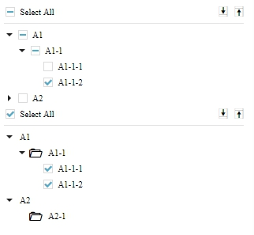

# tree-view




## Table of Contents

* [Installation](#installation)
* [API documentation](#api-documentation)
* [Examples](#examples)

## Installation

You can use [npm](https://npmjs.org/) to install:

    $ npm install https://github.com/JulioYu/tree-view.git


## API documentation

```jsx

<TreeView
    /*
    Boolean describing if the TreeView items display with a checkbox.
    Required.
    */
    hasCheckbox={false}

    /*
    Boolean describing if the TreeView has a "Select All" item.
    Required.
    */
    hasSelectAll={false}

    /*
    Boolean describing if the TreeView has multi-level.
    Optional, default value is true.
    */
    isMultiLevel={true}

    /*
    Boolean describing for the TreeView default collapsed status.
    Optional, default value is true.
    */
    collapsed={false}

    /*
    Boolean describing for the TreeView "Select All" checked status.
    Optional, default value is false.
    */
    checked={false}

    /*
    Function that will be run when there is any item has been checked. and it will also return an array of all data status.
    Required.
    */
    onCheck={handleOnCheck}

    /*
    The content which you want to display in TreeView.
    Required.
    */
    data={array}
/>

```

## Examples

Here is a simple example of tree-view:

```jsx
import React from 'react';
import ReactDOM from 'react-dom';
import TreeView from 'tree-view';

class App extends React.Component {

  constructor(props) {
    super(props);

    this.state = {
      activated: false
    };

    this.handleOnCheck = this.handleOnCheck.bind(this);
  }

  handleOnClick() {
    this.setState({
      activated: true
    });
  }

  render() {
    return (
      <div>
        <TreeView
          data={kpiData}
          onCheck={this.handleOnCheck}
          hasCheckbox={true}
          hasSelectAll={true}
        />
      </div>
    );
  }
}

ReactDOM.render(<App />, appElement);
```

## Data Structure Sample

```jsx
[
  {
    "index": 1,
    "id": "A1",
    "name": "A1",
    "noCheckbox": true, // Depends on requirement.
    "children": [
      {
        "index": 1,
        "id": "A1-1",
        "name": "A1-1",
        "noCheckbox": true, // Depends on requirement.
        "icon": "icon-folder-open", // Depends on requirement.
        "children": [
          {
            "index": 1,
            "id": "A1-1-1",
            "name": "A1-1-1",
            "checked": true
          },
          {
            "index": 2,
            "id": "A1-1-2",
            "name": "A1-1-2",
            "checked": true,
          }
        ],
        "checked": true
      }
    ],
    "checked": 2
  },
  {
    "index": 2,
    "id": "A2",
    "name": "A2",
    "children": [
      {
        "index": 1,
        "id": "A2-1",
        "name": "A2-1",
        "checked": false
      }
    ],
    "checked": false
  }
]
```